#POSGRADO-ECI  
Procesos de Desarrollo de Software 2017-1  
* #####Scrum master:  
	* ######Laura Milena Ramos   
* #####Team:  
	* ######Oscar Alba  
	* ######Brandon Nicolai Prieto  
    * ######Daniel Felipe Rodriguez Trujillo  
    * ######Camilo Torres  
* #####Product owner:  
	* ######Hector Fabio Cadavid Rengifo

##Descripción del producto  
* ###Descripción general  
   POSGRADO-ECI, es una aplicación web realizada para facilitar  el resgistro de clases de posgrado de la Escuela    Colombiana de ingeniería Julio Garavito.Actualmente este registro de clases de posgrado se realiza mediante excel por esta razon se hace tedioso el trabajo del administrador para registrar nuevas clases de determinadas materias con determinados profesores. Por esta razon se decide hacer e implementar este proyecto en el cual se desarrolla una aplicacion web que cuenta con opciones que facilitan la consulta de programacion semestral para algun educador que quiera consultar su horario según el periodo academico,un administrador para consultar la programacion semestral de todas las clases programadas por materia y cohorte segun el periodo academico, facilitando tambien el re,tambien permite el registro de nuevas asignaturas,materias,cohortes,etc.  

* ###Historias de usuario  
   Las historias de usuario consideradas fueron:
	* ####Autenticación.
	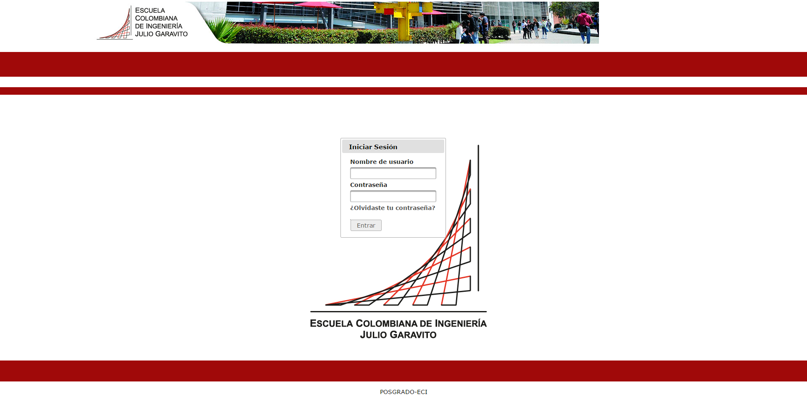
	* ####Reporte general.
	
	* ####Reporte de recursos.
	
	* ####Registrar Materia.
	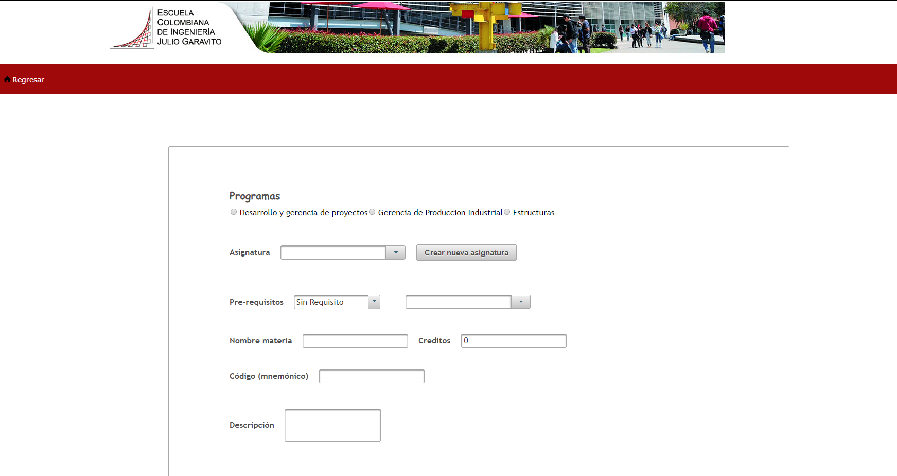
	* ####Programar una Clase.
	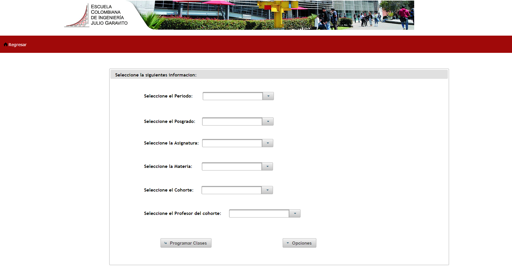
	* ####Reporte de horario del profesor
	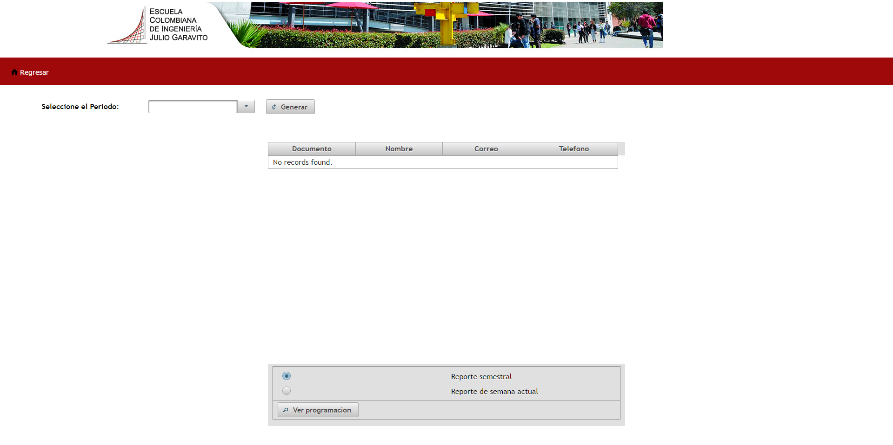

##Arquitectura y diseño  
Esta plataforma usa las siguientes dependencias:
* Junit: para ejecutar pruebas unitarias
* Javax:mysql-connector-java
* Mysql: para permitir la conexión con la base de datos.
* Org.mybatis: para utilizar Mybatis como herramienta de persistencia.
* Log4j: se utiliza para mensajes de alerta por consola.
* Apache-log4j-extras: se utiliza para mensajes de alerta por consola.
* Com.h2database: para crear bases de datos embebidas para las pruebas
* Org.apache.shiro: para ejecutar la seguridad, manejo de perfiles.
* Org.primefaces: para utilizar un conjunto de etiquetas que soporta primefaces.
* Com.sun.faces:para utilizar un conjunto de etiquetas que soporta primefaces.  

* ###Arquitectura 

	* ###Modelo E-R  
		* ####Vertabelo:
		
		* ####Astah:
		
    	* ####Capa Presentacion:
		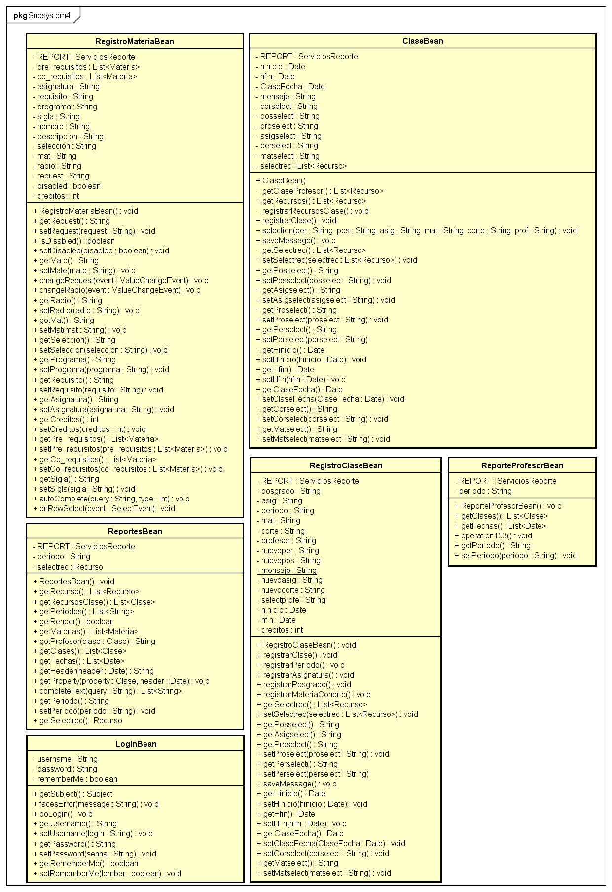
    	* ####Capa Logica:
		
    	* ####Capa Persistencia:
		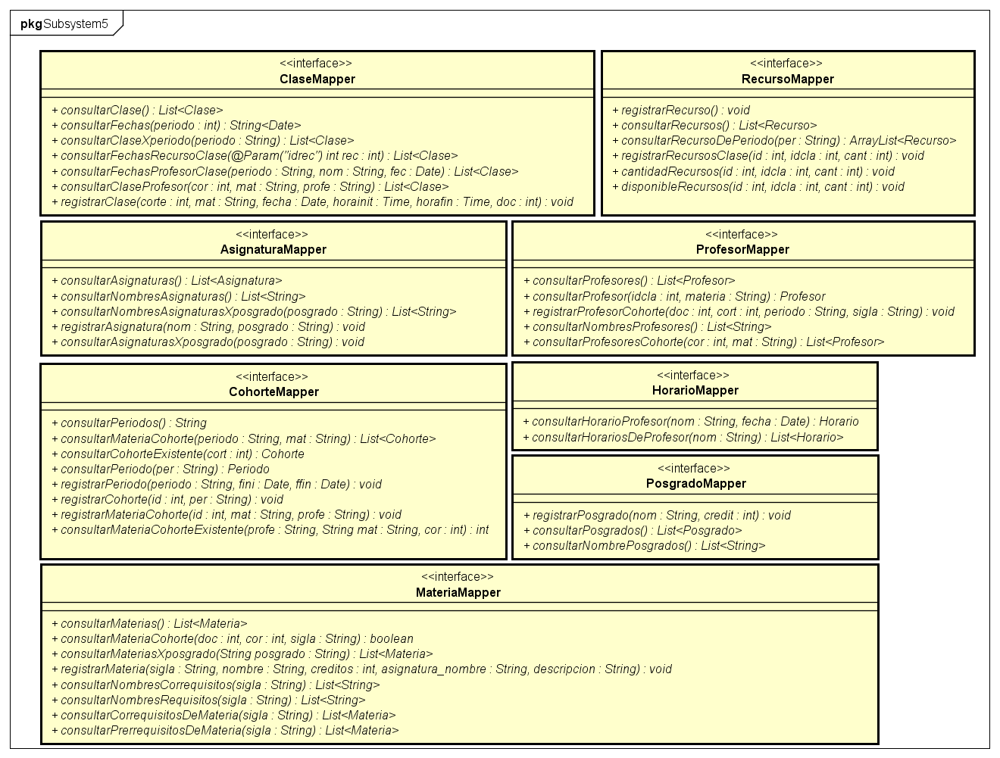
    * ####Diagrama conceptual:
	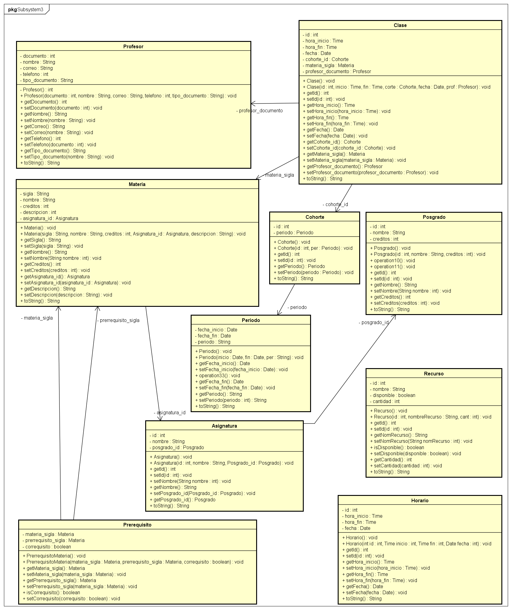
##Descripción del proceso
Descripción del proceso de desarrollo utilizado, y de las prácticas consideradas para el mismo Para el proceso de desarrollo se utilizó el framework de SCRUM, junto con las prácticas que este implica.
URL Trello: https://trello.com/b/3VXePyc4/2017-1-proypdsw-postgrado-eci

	* ###Backlogs y Burndown-charts de los Sprints
  	* ####Sprint 1
  		* #####Observaciones:
  		En este Tercer Sprint se completaron todas las historias del Sprint backlog corresponidnetes,el trabajo se realizo mayoritariamente depues de semana santa por esta razon el bornout esta por ecima de lo estimado, se trabajo mas para completar el Sprint en los utimos dias antes de la entrega, no se dejaron historias sin terminar para este sprint.
	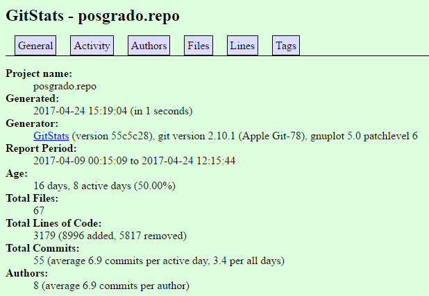
    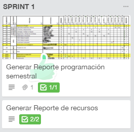
    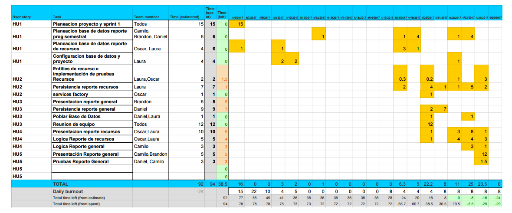
    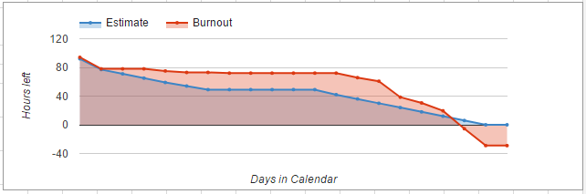
	* ####Sprint 2
		* #####Observaciones:
		En el segundo sprint se trabajo constantemente y se evidecio una mejora ecuanto a el trabajo constante del equipo y se completaron las historias de usuario correspondientes a este sprint sin embargo en el sprint review se identificaron  nuevas caracteristicas a revisar las cuales se pretenden completar para el tercer Sprint.
	
    
	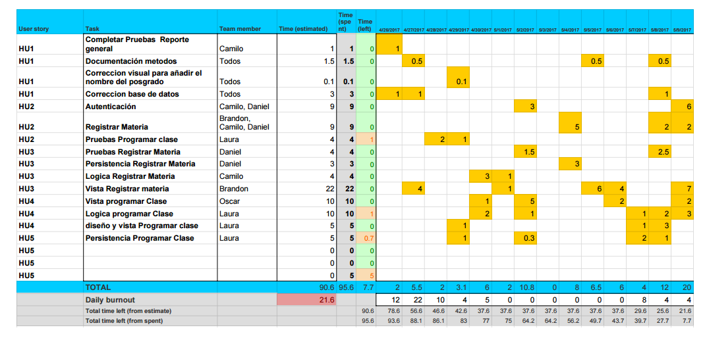
  	
	* ####Sprint 3
		* #####Observaciones:
		Se completaron las historias de usuario del sprint backlog correspondientes al tercer sprint teniendoo ecuenta las cosideraciones que se mencionaron en el segundo sprint.El trabajo del equipo no fue constante por la semana de parciales por lo cual se acomulo trabajo en los dias proximos al sprint review.
	
	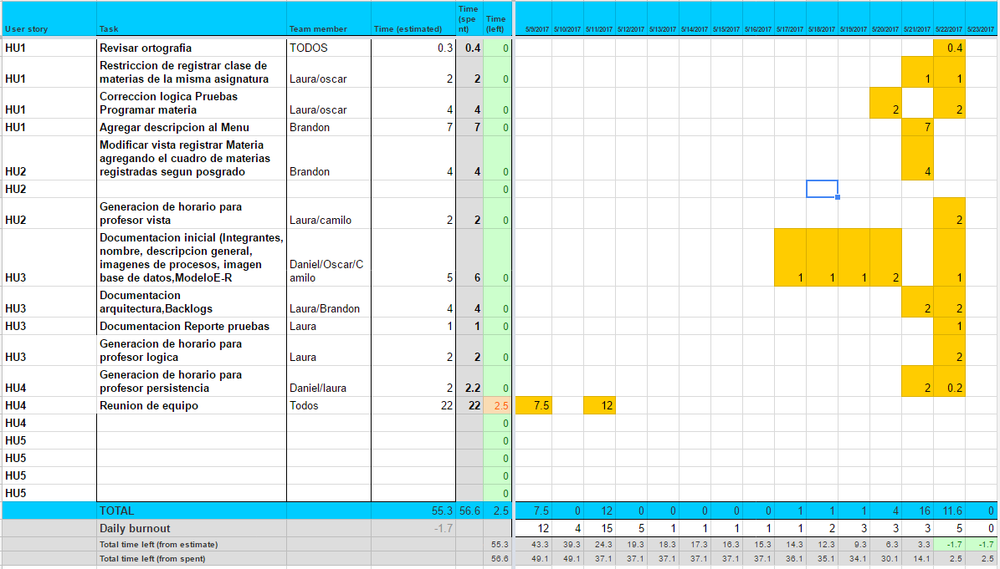
  	
  * ####Métricas por desarrollador
  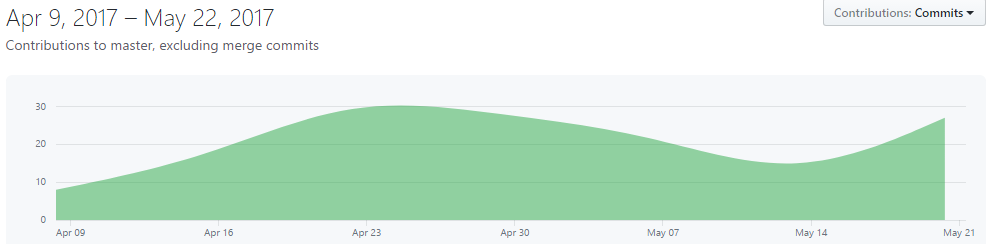
  	*	####Oscar Alba
  	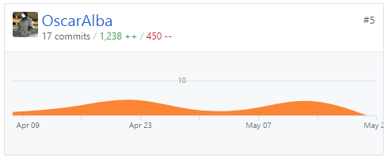
  	*	####Brandon Prieto
  	
  	*	####Laura Milena Ramos
  	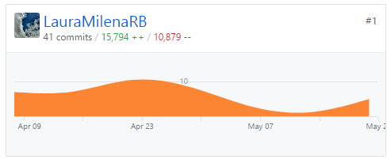
  	*	####Daniel Rodriguez
  	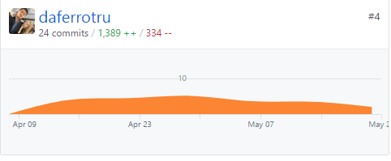
  	*	####Camilo Torres
  	

##Reporte de pruebas
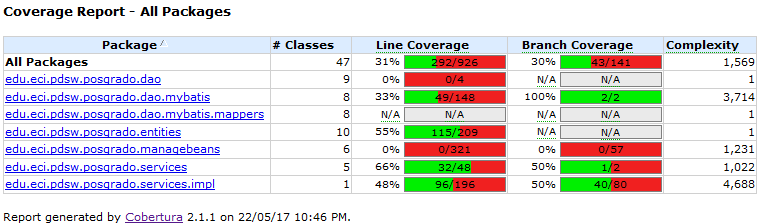

#####Url Trello: https://trello.com/b/3VXePyc4/2017-1-proypdsw-postgrado-eci
#####Url Circleci:  https://circleci.com/gh/PDSW-POSGRADO-ECI/posgrado
#####Url Heroku:  https://posgrado-eci.herokuapp.com/
