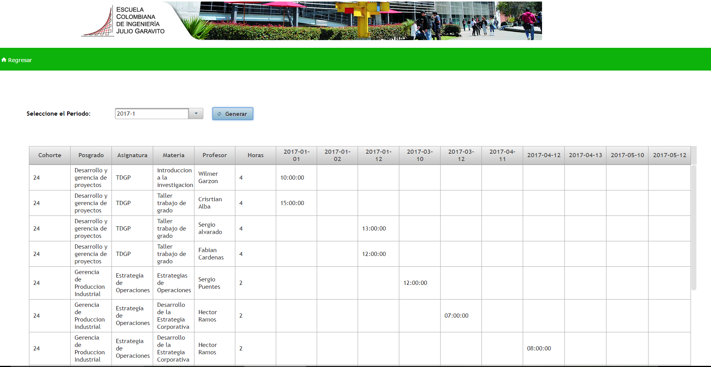
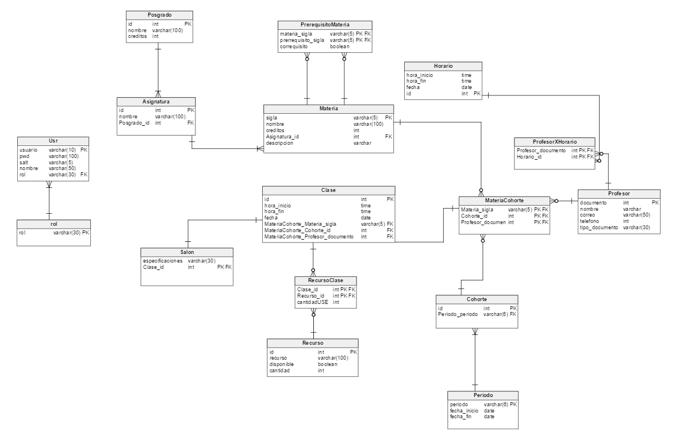

#POSGRADO-ECI
	Procesos de Desarrollo de Software 2017-1
        Scrum master:
            Laura Milena Ramos
        Team:
            Oscar Alba
            Brandon Nicolai Prieto
            Daniel Felipe Rodriguez Trujillo
            Camilo Torres
        Profesor/Asesor:
            Hector Fabio Cadavid Rengifo
        Product owner:

##Descripción del producto
* ###Descripción general
   POSGRADO-ECI, es una aplicación web realizada para facilitar  el resgistro de clases de posgrado de la Escuela    Colombiana de ingeniería Julio Garavito.Actualmente este registro de clases de posgrado se realiza mediante excel por esta razon se hace tedioso el trabajo del administrador para registrar nuevas clases de determinadas materias con determinados profesores. Por esta razon se decide hacer e implementar este proyecto en el cual se desarrolla una aplicacion web que cuenta con opciones que facilitan la consulta de programacion semestral para algun educador que quiera consultar su horario según el periodo academico,un administrador para consultar la programacion semestral de todas las clases programadas por materia y cohorte segun el periodo academico, facilitando tambien el re,tambien permite el registro de nuevas asignaturas,materias,cohortes,etc.

* ###Historias de usuario
   Las historias de usuario consideradas fueron:
	* ####Reporte general.
	
	* ####Reporte de recursos.
	
	* ####Registrar Materia.
	
	* ####Programar una Clase.
	

##Arquitectura y diseño
Esta plataforma usa las siguientes dependencias:
* Junit: para ejecutar pruebas unitarias
* Javax:mysql-connector-java
* Mysql: para permitir la conexión con la base de datos.
* Org.mybatis: para utilizar Mybatis como herramienta de persistencia.
* Log4j: se utiliza para mensajes de alerta por consola.
* Apache-log4j-extras: se utiliza para mensajes de alerta por consola.
* Com.h2database: para crear bases de datos embebidas para las pruebas
* Org.apache.shiro: para ejecutar la seguridad, manejo de perfiles.
* Org.primefaces: para utilizar un conjunto de etiquetas que soporta primefaces.
* Com.sun.faces:para utilizar un conjunto de etiquetas que soporta primefaces

* ###Arquitectura
* ###Modelo E-R
	* ####Vertabelo:
	
	* ####Astah:
	
* ###Diagrama de clases

##Descripción del proceso
Descripción del proceso de desarrollo utilizado, y de las prácticas consideradas para el mismo Para el proceso de desarrollo se utilizó el framework de SCRUM, junto con las prácticas que este implica.
  * ###Backlogs y Burndown-charts de los Sprints
  * ###Release-Burndown-chart
  	* ####Sprint 1
  	* ####Sprint 2
  	* ####Sprint 3
  * ####Métricas por desarrollador
  	*	####Oscar Alba
  	*	####Brandon Prieto
  	*	####Laura Milena Ramos
  	*	####Daniel Rodriguez
  	*	####Camilo Torres

##Reporte de pruebas
* ###Reporte general
* ###Reporte de recursos
* ###Registrar Materia
* ###Programar una Clase

#####Url Circleci  https://circleci.com/gh/PDSW-POSGRADO-ECI/posgrado
#####Url Heroku  https://posgrado-eci.herokuapp.com/